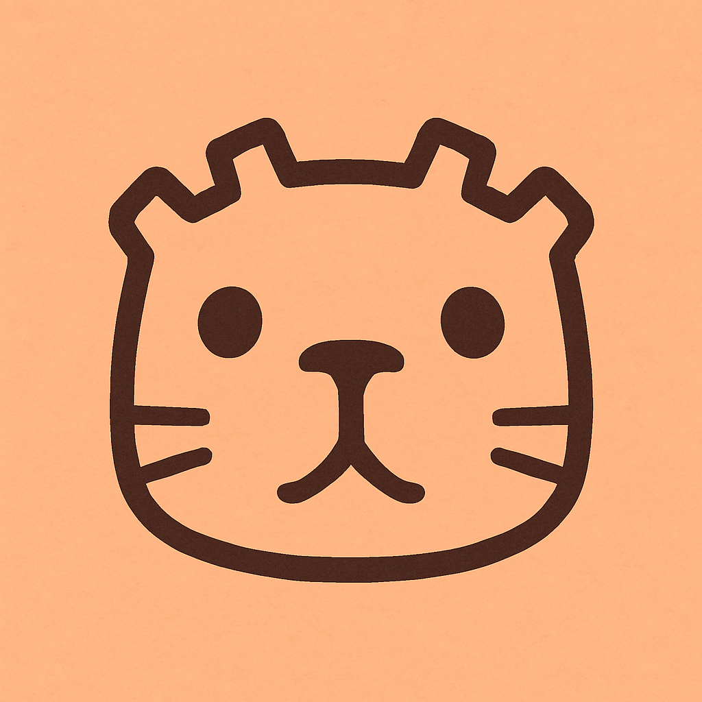

<h1 align="center">Unnamed Game</h3>

---

🎮 Un videojuego RPG creado en Godot Engine 4.4 donde el protagonista es el animal más chill del planeta: el carpincho, realizado para la Godot Game Jam por Carpincho Team.


### Cómo ejecutar el juego
1. Cloná el repositorio:
   ```bash
   git clone https://github.com/natayadev/carpincho-team.git
   ```

2. O jugalo en: [AGREGAR LINK DE ITCH . IO CUANDO ESTÉ PUBLICADO]
